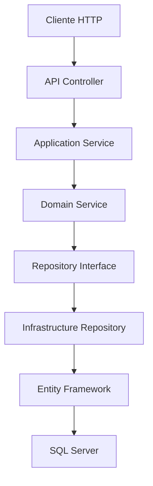

# 🏦 AppCreditos BackEnd

<div align="center">


**Plataforma de Gestión de Créditos en Línea**  
*Sistema Backend desarrollado con Clean Architecture y Arquitectura Hexagonal*

</div>

---

## 📋 Tabla de Contenidos

- [🚀 Inicio Rápido](#-inicio-rápido)
- [📦 Instalación](#-instalación)
- [🏗️ Arquitectura](#️-arquitectura)
- [💡 Lógica de Desarrollo](#-lógica-de-desarrollo)
- [⚡ Funcionalidades](#-funcionalidades)
- [✅ Buenas Prácticas](#-buenas-prácticas)
- [🔧 Configuración](#-configuración)
- [📖 Documentación API](#-documentación-api)
- [🤝 Contribución](#-contribución)

---

## 🚀 Inicio Rápido

### Requisitos Previos

Antes de comenzar, asegúrate de tener instalado:

| Herramienta | Versión Mínima | Propósito |
|-------------|----------------|-----------|
| **.NET SDK** | 8.0+ | Framework de desarrollo |
| **SQL Server** | 2019+ | Base de datos |
| **Visual Studio** | 2022+ | IDE (recomendado) |
| **Git** | 2.30+ | Control de versiones |

### ⚡ Instalación Rápida

```bash
# 1. Clonar el repositorio
git clone [URL_DE_TU_REPOSITORIO]
cd AppCreditosBackEnd

# 2. Restaurar dependencias
dotnet restore

# 3. Configurar base de datos
dotnet ef database update

# 4. Ejecutar la aplicación
dotnet run --project AppCreditosBackEnd.Api
```

🎉 **¡Listo!** La API estará disponible en `https://localhost:7000`

---

## 📦 Instalación Detallada

### 1️⃣ Clonar el Repositorio

```bash
git clone [URL_DE_TU_REPOSITORIO]
cd AppCreditosBackEnd
```

### 2️⃣ Verificar Dependencias por Capa

#### 🎯 **AppCreditosBackEnd.Api** (Capa de Presentación)
```xml
<!-- Dependencias principales -->
<PackageReference Include="Microsoft.AspNetCore.Authentication.JwtBearer" Version="8.0.0" />
<PackageReference Include="Microsoft.AspNetCore.OpenApi" Version="8.0.0" />
<PackageReference Include="Swashbuckle.AspNetCore" Version="6.4.0" />
<PackageReference Include="AutoMapper.Extensions.Microsoft.DependencyInjection" Version="12.0.1" />
```

#### 🧠 **AppCreditosBackEnd.Application** (Capa de Aplicación)
```xml
<!-- Dependencias principales -->
<PackageReference Include="AutoMapper" Version="12.0.1" />
<PackageReference Include="Microsoft.AspNetCore.Authentication.JwtBearer" Version="8.0.0" />
<PackageReference Include="Microsoft.Extensions.Configuration.Abstractions" Version="8.0.0" />
<PackageReference Include="System.IdentityModel.Tokens.Jwt" Version="7.0.0" />
```

#### 🏛️ **AppCreditosBackEnd.Domain** (Capa de Dominio)
```xml
<!-- Sin dependencias externas - Solo .NET 8.0 -->
<!-- Mantiene la independencia del dominio -->
```

#### 🔧 **AppCreditosBackEnd.Infrastructure** (Capa de Infraestructura)
```xml
<!-- Dependencias principales -->
<PackageReference Include="Microsoft.EntityFrameworkCore" Version="8.0.0" />
<PackageReference Include="Microsoft.EntityFrameworkCore.SqlServer" Version="8.0.0" />
<PackageReference Include="Microsoft.EntityFrameworkCore.Tools" Version="8.0.0" />
<PackageReference Include="Microsoft.EntityFrameworkCore.Design" Version="8.0.0" />
```

### 3️⃣ Restaurar Dependencias

```bash
# Restaurar todas las dependencias del solution
dotnet restore

# Verificar que todas las dependencias están instaladas
dotnet list package
```

### 4️⃣ Configurar Base de Datos

#### Configurar Connection String
Edita `appsettings.json` en el proyecto **AppCreditosBackEnd.Api**:

```json
{
  "ConnectionStrings": {
    "DefaultConnection": "Server=(localdb)\\mssqllocaldb;Database=AppCreditosDB;Trusted_Connection=true;MultipleActiveResultSets=true"
  }
}
```

#### Aplicar Migraciones
```bash
# Desde la carpeta raíz del proyecto
dotnet ef migrations add InitialCreate --project AppCreditosBackEnd.Infrastructure --startup-project AppCreditosBackEnd.Api

dotnet ef database update --project AppCreditosBackEnd.Infrastructure --startup-project AppCreditosBackEnd.Api
```

### 5️⃣ Ejecutar la Aplicación

```bash
# Opción 1: Desde línea de comandos
dotnet run --project AppCreditosBackEnd.Api

# Opción 2: Desde Visual Studio
# Abrir AppCreditosBackEnd.sln y presionar F5
```

---

## 🏗️ Arquitectura

### 📐 Clean Architecture + Arquitectura Hexagonal

El proyecto implementa **Clean Architecture** combinada con **Arquitectura Hexagonal** para garantizar:
- ✅ **Separación de responsabilidades**
- ✅ **Independencia de frameworks**
- ✅ **Testabilidad**
- ✅ **Mantenibilidad**

```
📁 AppCreditosBackEnd/
├── 🎯 AppCreditosBackEnd.Api/          # Capa de Presentación
│   ├── Controllers/                     # Controladores REST
│   ├── Filters/                        # Filtros personalizados
│   ├── Helpers/                        # Helpers de API
│   └── Program.cs                      # Configuración de la aplicación
├── 🧠 AppCreditosBackEnd.Application/   # Capa de Aplicación
│   ├── Services/                       # Servicios de aplicación
│   ├── Interfaces/                     # Contratos de servicios
│   ├── DTOs/                          # Objetos de transferencia
│   ├── Mappings/                      # Perfiles de AutoMapper
│   └── Helpers/                       # Configuraciones JWT
├── 🏛️ AppCreditosBackEnd.Domain/        # Capa de Dominio
│   ├── Entities/                      # Entidades del negocio
│   ├── Enums/                         # Enumeraciones
│   └── Interfaces/                    # Contratos de repositorios
└── 🔧 AppCreditosBackEnd.Infrastructure/ # Capa de Infraestructura
    ├── DbContext/                     # Contexto de Entity Framework
    ├── Repositories/                  # Implementación de repositorios
    └── Persistence/                   # Configuraciones de persistencia
```

### 🔄 Flujo de Datos



---

## 💡 Lógica de Desarrollo

### 🎯 Principios Aplicados

#### **SOLID Principles**
- 🔸 **S**ingle Responsibility: Cada clase tiene una única responsabilidad
- 🔸 **O**pen/Closed: Abierto para extensión, cerrado para modificación
- 🔸 **L**iskov Substitution: Los objetos derivados pueden reemplazar a sus bases
- 🔸 **I**nterface Segregation: Interfaces específicas mejor que una general
- 🔸 **D**ependency Inversion: Depender de abstracciones, no de concreciones

#### **Domain Driven Design (DDD)**
- 🏛️ **Entidades del Dominio**: `Users`, `CreditApplication`, `AuditLog`
- 🔀 **Enums del Negocio**: `UserRole`, `ApplicationStatus`  
- 🤝 **Repositorios**: Abstracción del acceso a datos
- 📋 **Servicios de Dominio**: Lógica de negocio compleja

#### **Repository Pattern**
```csharp
// Abstracción en Domain
public interface ICreditApplicationRepository
{
    Task<CreditApplication> GetByIdAsync(int id);
    Task<CreditApplication> CreateAsync(CreditApplication application);
    // ... más métodos
}

// Implementación en Infrastructure
public class CreditApplicationRepository : ICreditApplicationRepository
{
    // Implementación con Entity Framework
}
```

#### **Dependency Injection**
- ⚡ **Inyección por Constructor**: Dependencias explícitas
- 🔧 **Configuración en Program.cs**: Registro de servicios
- 🎯 **Lifetime Management**: Singleton, Scoped, Transient

---

## ⚡ Funcionalidades

### 🔐 **Sistema de Autenticación JWT**

#### Endpoints de Autenticación
| Método | Endpoint | Descripción |
|--------|----------|-------------|
| `POST` | `/api/Auth/register` | Registro de usuarios |
| `POST` | `/api/Auth/login` | Inicio de sesión |
| `POST` | `/api/Auth/refresh` | Renovar token |
| `POST` | `/api/Auth/logout` | Cerrar sesión |

#### Roles de Usuario
- 👤 **Applicant**: Solicitantes de crédito
- 👨‍💼 **Analyst**: Analistas evaluadores

### 💳 **Gestión de Solicitudes de Crédito**

#### Endpoints Principales
| Método | Endpoint | Descripción | Roles |
|--------|----------|-------------|-------|
| `POST` | `/api/CreditApplication` | Crear solicitud | Applicant |
| `GET` | `/api/CreditApplication` | Listar solicitudes | Analyst |
| `GET` | `/api/CreditApplication/{id}` | Obtener solicitud | Applicant/Analyst |
| `PUT` | `/api/CreditApplication/{id}/status` | Actualizar estado | Analyst |

#### Estados de Solicitud
- 🟡 **Pending**: En evaluación
- 🟢 **Approved**: Aprobada
- 🔴 **Rejected**: Rechazada

### 📊 **Sistema de Auditoría**

#### Funcionalidades de Auditoría
- 📝 **Registro Automático**: Todas las acciones se registran
- 🔍 **Consultas Avanzadas**: Filtros por usuario, fecha, acción
- 📈 **Estadísticas**: Reportes y métricas
- 🔄 **Paginación**: Consultas optimizadas

#### Endpoints de Auditoría
| Método | Endpoint | Descripción |
|--------|----------|-------------|
| `GET` | `/api/AuditLogs` | Todos los logs |
| `GET` | `/api/AuditLogs/filter` | Filtros avanzados |
| `GET` | `/api/AuditLogs/paginated` | Consulta paginada |
| `GET` | `/api/AuditLogs/statistics` | Estadísticas |

### 🤖 **Evaluación Automática de Crédito**

#### Algoritmo de Evaluación
```csharp
// Lógica simplificada del algoritmo
public ApplicationStatus EvaluateCredit(CreditApplication application)
{
    var debtToIncomeRatio = application.RequestedAmount / application.MonthlyIncome;
    var experienceScore = application.WorkExperienceYears * 0.1m;
    
    if (debtToIncomeRatio <= 3 && experienceScore >= 0.5m)
        return ApplicationStatus.Approved;
    else if (debtToIncomeRatio <= 5)
        return ApplicationStatus.Pending;
    else
        return ApplicationStatus.Rejected;
}
```

---

## ✅ Buenas Prácticas

### 🏗️ **Arquitectura y Diseño**

#### ✅ Clean Architecture
- **Separación clara** de responsabilidades por capas
- **Independencia** de frameworks y tecnologías externas
- **Testabilidad** a través de interfaces y dependency injection

#### ✅ Repository Pattern
- **Abstracción** del acceso a datos
- **Facilita testing** con mocks
- **Cambio de ORM** sin afectar lógica de negocio

#### ✅ Dependency Injection
- **Inversión de control** para mejor testabilidad
- **Configuración centralizada** en Program.cs
- **Lifetime management** apropiado para cada servicio

### 🔐 **Seguridad**

#### ✅ Autenticación JWT
```csharp
// Configuración segura de JWT
services.AddAuthentication(JwtBearerDefaults.AuthenticationScheme)
    .AddJwtBearer(options =>
    {
        options.TokenValidationParameters = new TokenValidationParameters
        {
            ValidateIssuer = true,
            ValidateAudience = true,
            ValidateLifetime = true,
            ValidateIssuerSigningKey = true,
            // ... configuraciones adicionales
        };
    });
```

#### ✅ Autorización por Roles
- **Control granular** de acceso por endpoint
- **Decoradores [Authorize]** para proteger recursos
- **Validación de roles** en tiempo de ejecución

#### ✅ Validación de Datos
- **DTOs** para validar entrada de datos
- **Data Annotations** para reglas de validación
- **Responses consistentes** con ApiResponse<T>

### 📊 **Logging y Auditoría**

#### ✅ Sistema de Auditoría Completo
- **Registro automático** de todas las acciones
- **Trazabilidad completa** de cambios
- **Información contextual** (usuario, timestamp, detalles)

#### ✅ Structured Logging
```csharp
// Ejemplo de logging estructurado
_logger.LogInformation("Credit application {ApplicationId} created by user {UserId}", 
    application.Id, userId);
```

### 🧪 **Calidad de Código**

#### ✅ Separación de Responsabilidades
- **Controladores ligeros**: Solo manejan HTTP
- **Servicios de aplicación**: Lógica de coordinación
- **Servicios de dominio**: Lógica de negocio pura

#### ✅ Mapeo Automático
```csharp
// AutoMapper para reducir código repetitivo
public class MappingProfile : Profile
{
    public MappingProfile()
    {
        CreateMap<CreditApplication, CreditApplicationResponseDto>();
        CreateMap<CreateCreditApplicationDto, CreditApplication>();
    }
}
```

#### ✅ Configuración Flexible
- **appsettings.json** para diferentes entornos
- **Configuración de JWT** externalizada
- **Connection strings** configurables

### 🚀 **Performance**

#### ✅ Consultas Optimizadas
- **Include()** para evitar N+1 queries
- **Paginación** en consultas grandes
- **Índices** en campos frecuentemente consultados

#### ✅ Async/Await
```csharp
// Operaciones asíncronas para mejor rendimiento
public async Task<ApiResponse<CreditApplicationResponseDto>> CreateAsync(
    CreateCreditApplicationDto dto)
{
    // Implementación asíncrona
}
```

### 📋 **Mantenibilidad**

#### ✅ Código Limpio
- **Nombres descriptivos** para clases y métodos
- **Métodos pequeños** con responsabilidad única
- **Comentarios solo cuando es necesario**

#### ✅ Consistencia
- **Convenciones de nomenclatura** consistentes
- **Estructura de respuestas** estandarizada
- **Manejo de errores** uniforme

---

## 🔧 Configuración

### ⚙️ Variables de Entorno

Configura las siguientes variables en `appsettings.json`:

```json
{
  "ConnectionStrings": {
    "DefaultConnection": "TU_CONNECTION_STRING"
  },
  "JwtSettings": {
    "SecretKey": "TU_SECRET_KEY_MUY_SEGURA",
    "Issuer": "AppCreditos",
    "Audience": "AppCreditosUsers",
    "TokenExpirationInMinutes": 60,
    "RefreshTokenExpirationInDays": 7
  },
  "Logging": {
    "LogLevel": {
      "Default": "Information",
      "Microsoft.AspNetCore": "Warning"
    }
  }
}
```

### 🗄️ Base de Datos

#### Schema de la Base de Datos
El sistema utiliza **3 tablas principales**:

- **Users**: Gestión de usuarios del sistema
- **CreditApplications**: Solicitudes de crédito
- **AuditLogs**: Registro de auditoría

Para más detalles, consulta la [documentación del modelo ER](docs/database-model.md).

---

## 📖 Documentación API

### 🌐 Swagger UI

Una vez que la aplicación esté ejecutándose, puedes acceder a la documentación interactiva:

- **Desarrollo**: `https://localhost:7000/swagger`
- **Producción**: `https://tu-dominio.com/swagger`

### 📝 Endpoints Principales

#### Autenticación
```http
POST /api/Auth/register
POST /api/Auth/login
POST /api/Auth/refresh
POST /api/Auth/logout
```

#### Solicitudes de Crédito
```http
GET    /api/CreditApplication
POST   /api/CreditApplication
GET    /api/CreditApplication/{id}
PUT    /api/CreditApplication/{id}/status
```

#### Auditoría
```http
GET /api/AuditLogs
GET /api/AuditLogs/filter
GET /api/AuditLogs/paginated
GET /api/AuditLogs/statistics
```

---

## 🧪 Testing

### Ejecutar Pruebas

```bash
# Ejecutar todas las pruebas
dotnet test

# Ejecutar pruebas con cobertura
dotnet test --collect:"XPlat Code Coverage"
```

### Estructura de Testing
```
📁 Tests/
├── 🧪 Unit Tests/              # Pruebas unitarias
├── 🔗 Integration Tests/       # Pruebas de integración
└── 📊 Performance Tests/       # Pruebas de rendimiento
```

---

## 🚀 Deployment

### 🐳 Docker

```dockerfile
# Dockerfile incluido en el proyecto
FROM mcr.microsoft.com/dotnet/aspnet:8.0 AS base
WORKDIR /app
EXPOSE 80
EXPOSE 443

# Build y publicación
FROM mcr.microsoft.com/dotnet/sdk:8.0 AS build
# ... resto de la configuración
```

### ☁️ Azure/AWS

El proyecto está preparado para deployment en la nube con:
- **Configuration providers** para diferentes entornos
- **Health checks** para monitoreo
- **Logging estructurado** para observabilidad

---

## 🤝 Contribución

### 📋 Proceso de Contribución

1. **Fork** el repositorio
2. **Crear** una rama feature (`git checkout -b feature/nueva-funcionalidad`)
3. **Commit** los cambios (`git commit -am 'Añadir nueva funcionalidad'`)
4. **Push** a la rama (`git push origin feature/nueva-funcionalidad`)
5. **Crear** un Pull Request

### 📏 Estándares de Código

- Seguir las **convenciones de C#**
- **Tests unitarios** para nueva funcionalidad
- **Documentación** para APIs públicas
- **Clean Code principles**

---

## 📄 Licencia

Este proyecto está bajo la Licencia MIT - ver el archivo [LICENSE](LICENSE) para detalles.

---

## 👥 Equipo

Desarrollado con ❤️ por el equipo de desarrollo

---

<div align="center">

**¿Preguntas o sugerencias?**  
[Crear un Issue](../../issues) • [Contactar al equipo](mailto:tu-email@ejemplo.com)

---

⭐ **¡No olvides dar una estrella si este proyecto te fue útil!** ⭐

</div>